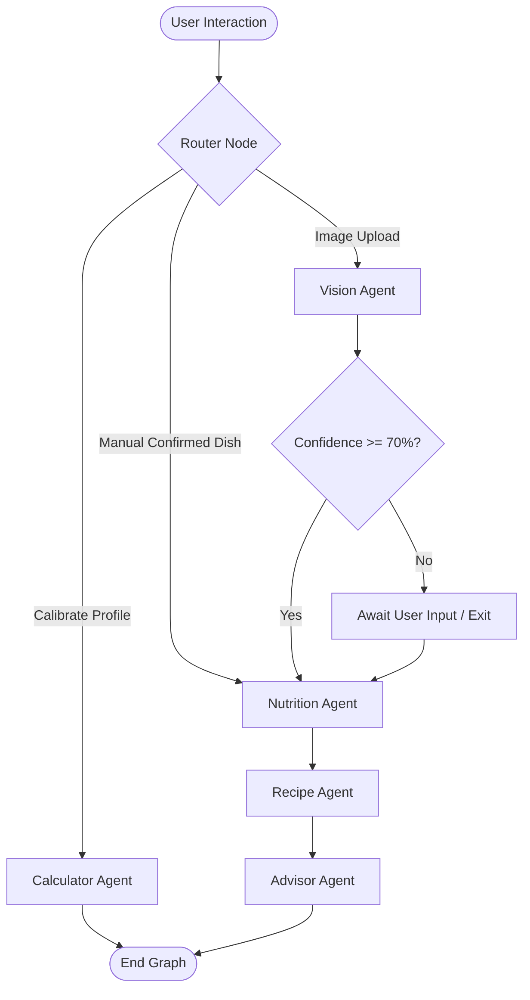

# 🥗 DietFit - A Friendly Diet Advisor

[](https://dietfit-b6zhx88cokxf4yghmwynvz.streamlit.app/)


DietFit is a premium, agent-driven AI fitness planning and recipe personalization platform. It combines a beautiful **Streamlit** user interface with a robust multi-agent orchestration graph powered by **LangGraph**. The platform allows users to input their stats, calibrate dietary targets, upload food images for automated visual recognition, retrieve detailed USDA-backed nutrition metrics, and receive personalized recipe adjustments and advice from an AI sports nutritionist agent.

---

## 🌟 Key Features

* **🔐 Personalized User Space:** Save profiles, set fitness goals (e.g., Lose Fat, Build Muscle, Maintain), and specify dietary preferences (e.g., Keto, Vegan, Balanced, Low Carb) using a unique **Email Address**.
* **📐 Automated Macro Calibration:** Computes BMR using the Mifflin-St Jeor formula and TDEE based on physical activity multipliers to dynamically structure daily calorie and macronutrient targets.
* **📸 Multimodal Food Vision:** Identifies food dishes directly from image uploads using Google's **Gemini 2.5 Flash** model.
* **🔍 USDA API Integration:** Retrieves precise nutritional information (Calories, Protein, Carbs, Fat) using the USDA FoodData Central API, with an intelligent LLM backup estimator.
* **🍳 Intelligent Recipe Personalization:** Locates recipes using Tavily search queries and re-engineers ingredient ratios or serving sizes to fit the user's customized daily macro targets.

---

## 🏗️ Architecture & Agent Flow

The application coordinates multiple specialized agents utilizing **LangGraph** to process and transition states between nodes based on user configuration and confidence metrics.



### Specialized Agents

1. **Calculator Agent (`calculator.py`):** Calculates BMR/TDEE and calibrates target daily limits based on goals and chosen diets.
2. **Vision Agent (`vision.py`):** Performs food recognition using the Gemini 2.5 Flash model. If the classification confidence is below 70%, the process pauses to allow manual user confirmation.
3. **Nutrition Agent (`nutrition.py`):** Resolves macronutrients of identified dishes using the USDA API database, failing back to a Groq LLM estimator.
4. **Recipe Agent (`recipe.py`):** Performs web search for the dish's recipe using Tavily, structuring it cleanly into ingredients, measures, and directions.
5. **Advisor Agent (`advisor.py`):** The final evaluation node that compares original recipe macros against user limits, adjusting portions or substituting ingredients with explicit math breakdown.

---

## 📂 Project Directory Structure

```text
├── agents/
│   ├── __init__.py
│   ├── advisor.py       # Recipe feedback and sports nutrition analysis
│   ├── calculator.py    # Mifflin-St Jeor BMR & calorie limit calculator
│   ├── nutrition.py     # Resolves macronutrient values via USDA or LLM
│   ├── recipe.py        # Fetches and structures recipes via Tavily Search
│   └── vision.py        # Orchestrates Gemini image analysis
├── utils/
│   ├── gemini.py        # Gemini 2.5 Flash vision integration
│   ├── storage.py       # JSON storage helper for user profiles
│   └── usda.py          # USDA API client connection helper
├── app.py               # Streamlit application dashboard & UI
├── graph.py             # LangGraph workflow and state transitions
├── state.py             # LangGraph AgentState TypedDict definition
├── style.css            # Dark mode and micro-animation styles
├── users.json           # User profiles persistent file
├── pyproject.toml       # Project package description & tool configs
├── requirements.txt     # Python environment requirements list
└── README.md            # Project documentation (this file)
```

---

## ⚡ Getting Started

### 📋 Prerequisites

* Python **>= 3.13**
* Virtual environment tool (e.g., `venv`, `conda` or `uv`)

### 🔧 Installation Steps

1. **Clone the Repository** and navigate into the project workspace:
   ```bash
   cd Fitness_agent_system
   ```

2. **Set Up a Virtual Environment** and activate it:
   ```bash
   # Using standard venv
   python -m venv .venv
   .venv\Scripts\activate  # On Windows
   # source .venv/bin/activate  # On macOS/Linux
   ```

3. **Install Dependencies**:
   ```bash
   pip install -r requirements.txt
   ```

4. **Configure Environment Variables**:
   Create a `.env` file in the root directory of the project and populate it with your API keys:
   ```env
   GOOGLE_API_KEY="your-gemini-api-key"
   GROQ_API_KEY="your-groq-api-key"
   TAVILY_API_KEY="your-tavily-api-key"
   USDA_API_KEY="your-usda-api-key"
   ```

---

## 🚀 Running the Application

Launch the Streamlit web dashboard locally using the command:

```bash
streamlit run app.py
```

The terminal will provide a local URL (usually `http://localhost:8501`) to access the interface. Log in or register in the sidebar using your email address to begin tracking your diet and plans.
