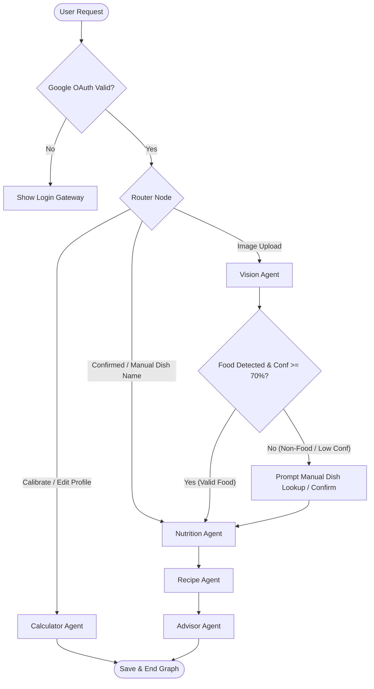

# 🥗 DietFit - Intelligent Nutrition & Meal Analysis

[](https://dietfit-b6zhx88cokxf4yghmwynvz.streamlit.app/) *Click to access the live application online*

DietFit is an agentic AI sports nutrition and meal intelligence platform. Built with a clean, responsive **Streamlit** user interface and an orchestration graph powered by **LangGraph**, DietFit automates dietary macro calibration, multimodal food recognition via Google Gemini 2.5 Flash, USDA-backed nutrition retrieval, authentic web recipe extraction, and personalized culinary adjustments.

---

## 🌟 Key Features

* **🔐 Zero-Trust Google OAuth 2.0:** Secure authentication with automated session timeout enforcement (30-minute inactivity sliding timeout, 24-hour absolute lifespan) and strict IDOR data ownership protections.
* **📐 Automated Macro Calibration & Profile Editing:** Computes BMR using the Mifflin-St Jeor formula and TDEE based on physical activity multipliers. Allows inline profile editing with dynamic target recalculation.
* **📸 Multimodal Food Vision & Safeguards:** Classifies food dishes directly from image uploads using Google's **Gemini 2.5 Flash** model with active **non-food detection safeguards**, a 70% confidence threshold, and human-in-the-loop manual entry fallback.
* **🔍 Dual-Layered Nutrition Resolver:** Retrieves official nutritional data (Calories, Protein, Carbs, Fat) from the USDA FoodData Central API, backed up by an LLM estimator.
* **🍳 Intelligent Recipe Personalization:** Locates recipes via Tavily Search and adjusts portion sizes or substitutes ingredients to align with the athlete's target macros.
* **🛡️ Enterprise Security & Rate Limiting:** In-memory sliding window rate limiters protecting against brute force, AI burst abuse, and denial-of-wallet vectors, supported by structured security event audit logging.

---

## 🏗️ Architecture & Agent Flow

The application coordinates specialized agents through a **LangGraph StateGraph** state machine.


```mermaid
flowchart TD
    Start([User Request]) --> AuthGate{Google OAuth Valid?}
    AuthGate -- "No" --> Login[Show Login Gateway]
    AuthGate -- "Yes" --> Route{Router Node}
    
    Route -- "Calibrate / Edit Profile" --> Calc[Calculator Agent]
    Route -- "Image Upload" --> Vision[Vision Agent]
    Route -- "Confirmed / Manual Dish Name" --> Nutrition[Nutrition Agent]
    
    Calc --> END([Save & End Graph])
    
    Vision --> FoodCheck{Food Detected & Conf >= 70%?}
    FoodCheck -- "Yes (Valid Food)" --> Nutrition
    FoodCheck -- "No (Non-Food / Low Conf)" --> UserFallback[Prompt Manual Dish Lookup / Confirm]
    UserFallback --> Nutrition
    
    Nutrition --> Recipe[Recipe Agent]
    Recipe --> Advisor[Advisor Agent]
    Advisor --> END
```

### Specialized Agents

1. **Calculator Agent (`agents/calculator.py`):** Calculates BMR/TDEE and macro splits (Keto, Vegan, Balanced, Low Carb) based on biometric stats and fitness goals.
2. **Vision Agent (`agents/vision.py`):** Performs food recognition using Gemini 2.5 Flash with non-food filtering, returning structured `is_food`, dish names, and confidence metrics.
3. **Nutrition Agent (`agents/nutrition.py`):** Resolves macronutrients of identified dishes using the USDA API, falling back to a Groq LLM estimator.
4. **Recipe Agent (`agents/recipe.py`):** Fetches and structures authentic recipes via Tavily Search and Llama-3.3-70B.
5. **Advisor Agent (`agents/advisor.py`):** Compares meal macros against user targets, proposing recipe modifications and exact serving calculations.

---

## 📂 Project Directory Structure

```text
├── agents/
│   ├── advisor.py            # Recipe adjustments and sports nutrition analysis
│   ├── calculator.py         # Mifflin-St Jeor BMR & calorie limit calculator
│   ├── nutrition.py          # Resolves macronutrient values via USDA or LLM
│   ├── recipe.py             # Fetches and structures recipes via Tavily Search
│   └── vision.py             # Orchestrates Gemini image analysis
├── utils/
│   ├── auth.py               # Session lifecycle, timeouts & cookie hashing
│   ├── email_service.py      # Secure SMTP alert and notification service
│   ├── gemini.py             # Gemini 2.5 Flash vision integration
│   ├── ratelimit.py          # Sliding-window rate limiters for abuse prevention
│   ├── security_logger.py    # Structured JSON security audit logger
│   ├── storage.py            # Atomic file storage with IDOR ownership validation
│   ├── usda.py               # USDA FoodData Central API client
│   └── validation.py         # Biometric and text input sanitization engine
├── tests/                    # Comprehensive unit and integration test suite
├── deploy/                   # Docker, Docker-Compose & Nginx TLS configs
├── app.py                    # Streamlit web dashboard & UI
├── graph.py                  # LangGraph workflow and state transitions
├── state.py                  # LangGraph AgentState TypedDict definition
├── style.css                 # Editorial wellness design system styles
├── pyproject.toml            # Project package description & tool configs
└── project_explanation.txt   # Comprehensive technical interview dossier
```

---

## ⚡ Getting Started

### 📋 Prerequisites

* Python **>= 3.13**
* Package manager (`uv` or `pip`)

### 🔧 Installation Steps

1. **Clone the Repository**:
   ```bash
   git clone https://github.com/nvangaveti/DietFit.git
   cd DietFit
   ```

2. **Set Up a Virtual Environment**:
   ```bash
   python -m venv .venv
   .venv\Scripts\activate      # Windows
   # source .venv/bin/activate  # macOS / Linux
   ```

3. **Install Dependencies**:
   ```bash
   pip install -e .
   ```

4. **Configure Environment Variables**:
   Create a `.env` file or `.streamlit/secrets.toml` with your credentials:
   ```env
   GOOGLE_API_KEY="your-gemini-api-key"
   GROQ_API_KEY="your-groq-api-key"
   TAVILY_API_KEY="your-tavily-api-key"
   USDA_API_KEY="your-usda-api-key"
   ```

5. **Run Automated Test Suite**:
   ```bash
   python -m unittest discover tests
   ```

---

## 🚀 Running the Application

Launch the Streamlit web dashboard locally:

```bash
streamlit run app.py
```

### Deployed Application
- **Live Streamlit App**: [https://dietfit-b6zhx88cokxf4yghmwynvz.streamlit.app/](https://dietfit-b6zhx88cokxf4yghmwynvz.streamlit.app/)
